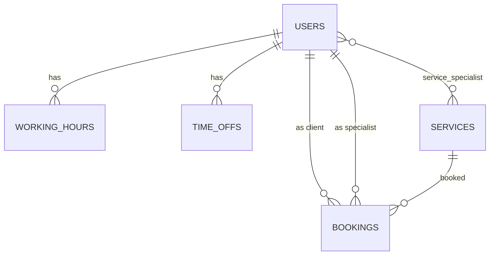

# Slotly API


Backend for an online appointment-booking service. Clients book time with specialists;
the API guarantees that two people can never book the same slot.

## Features

- Token authentication (Laravel Sanctum) with roles: client, specialist, admin
- Service catalogue and per-specialist working hours and time off
- Available-slot calculation (working windows, bookings, time off, lunch breaks)
- Booking and cancellation with policies, 409 on conflicts
- Queued e-mail confirmations and cancellations, scheduled reminders
- Auto-generated OpenAPI documentation

## Tech

PHP 8.5, Laravel 13, PostgreSQL 18, Redis, Pest, Larastan (level 7), Laravel Sail, GitHub Actions.

## Design decisions

- **Overlap protection lives in the database.** `bookings` has a PostgreSQL exclusion
  constraint (`EXCLUDE USING gist` on specialist + time range), so concurrent requests
  cannot create a double booking. PHP validation only gives friendly errors; the
  `23P01` violation is translated into HTTP 409.
- **Times are stored in UTC** (`timestamptz`); working hours are interpreted in the
  business time zone (`SLOTLY_TIMEZONE`).
- **Half-open intervals `[start, end)`** are used everywhere, so back-to-back bookings are valid.
- **Price is copied into the booking** to keep history stable when a service price changes.
- **Reminders are claimed atomically** (`UPDATE ... WHERE reminder_sent_at IS NULL`), so a
  reminder is never sent twice, even if the command runs concurrently.
- **Roles are never mass-assigned**, so a client cannot register as an admin.
- Thin controllers: validation in Form Requests, output in API Resources,
  business logic in `SlotService` and `BookingService`, side effects through events and queued notifications.
- Eloquent strict mode is enabled outside production to catch N+1 queries early.

## Data model



## Getting started

Requirements: Docker (and WSL2 on Windows).

```bash
git clone git@github.com:djakhanov980909/slotly-api.git
cd slotly-api
cp .env.example .env
docker run --rm -u "$(id -u):$(id -g)" -v "$(pwd):/var/www/html" -w /var/www/html \
  laravelsail/php84-composer:latest composer install --ignore-platform-reqs
./vendor/bin/sail up -d
./vendor/bin/sail artisan key:generate
./vendor/bin/sail artisan migrate --seed
```

- API: http://localhost:8080/api
- Documentation: http://localhost:8080/docs/api
- Mail catcher: http://localhost:8025
- Queue worker: `sail artisan queue:work`
- Scheduler: `sail artisan schedule:work`
- Demo admin: `admin@slotly.test` / `password`

## Tests and quality

```bash
sail artisan test
sail bin phpstan analyse
sail bin pint --test
```

## Main endpoints

| Method | Path | Description |
|---|---|---|
| POST | `/api/register`, `/api/login` | Get an API token |
| GET | `/api/services` | Service catalogue |
| GET | `/api/specialists/{id}/slots` | Free slots for a service on a date |
| POST | `/api/bookings` | Create a booking (409 if the slot is taken) |
| POST | `/api/bookings/{id}/cancel` | Cancel a booking |

Full reference: `/docs/api` or `docs/openapi.json`.
